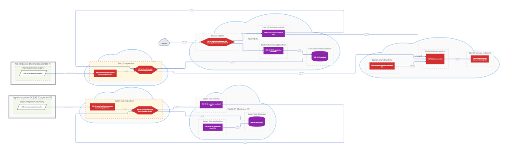
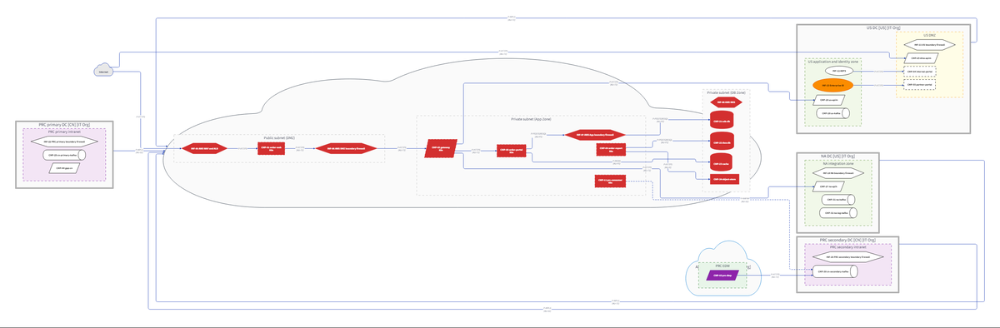
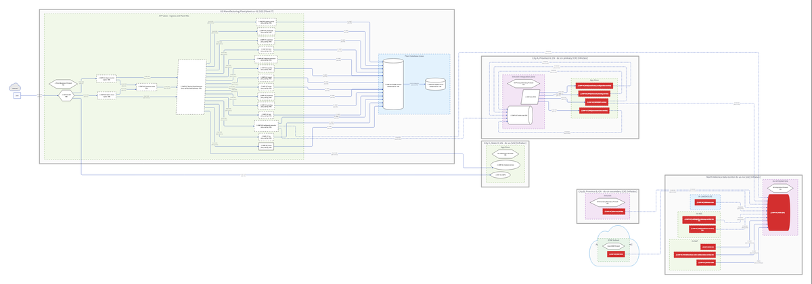
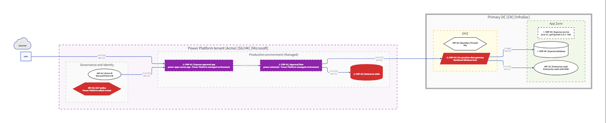
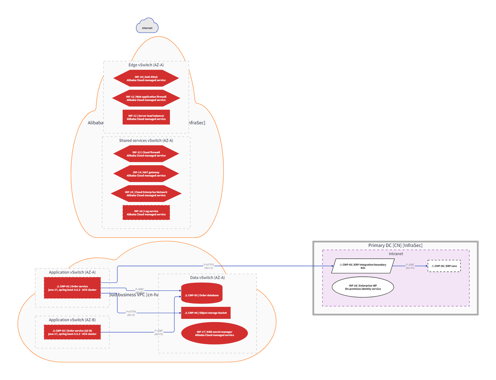
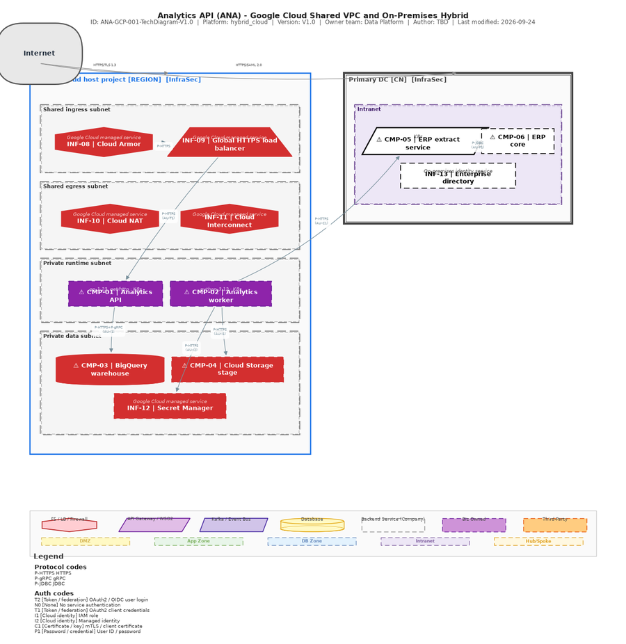
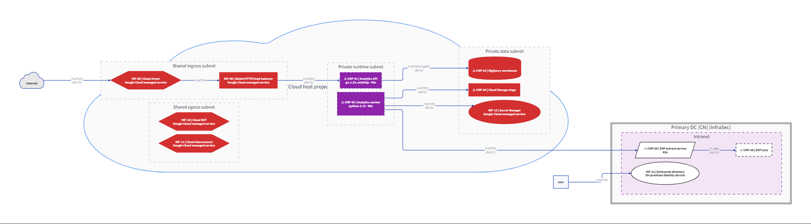

# ArchHarness

**English** | [中文](./README.zh-CN.md)

Enterprise architecture design and validation skill pack for **Claude Code**, **OpenCode**,
**Codex**, **GitHub Copilot**, and **Cursor**.

ArchHarness turns your AI coding assistant into a team of architecture specialists —
a requirements analyst, a senior architect, a paranoid security auditor, a committee reviewer,
and a technical writer — each invocable on demand with a single command.


> **Rendered with D2.** One architecture model compiles to both renderers:
> **draw.io** for the editable source, **D2** for the crisp presentation output.
> The images on this page are D2 renders.

> **Not yet another README-only repo.** `archharness` ships a real CLI
> (`python -m archharness`), a multi-project workspace layout, and platform skills that
> load enterprise values from a single config file — then proves the result: every
> artifact is hash-verified and the gate is deterministic.

## Example gallery

Six worked examples, one per platform standard — each end-to-end and runnable:
requirements, a `req/v2` inventory, an architecture blueprint, a rendered
diagram, and a standards check. Tiles show the **D2** render; click one to open
the example, which also carries the editable draw.io source.

<table>
  <tr>
    <td width="50%"><a href="examples/01-ecommerce-azure/"></a><br><b>Azure</b> — Hub-Spoke VNET + ExpressRoute · <i>D2 render</i></td>
    <td width="50%"><a href="examples/03-order-query-aws-hybrid/"></a><br><b>AWS</b> — Hub-Spoke VPC + Direct Connect · <i>D2 render</i></td>
  </tr>
  <tr>
    <td width="50%"><a href="examples/06-factory-mes-industrial/"></a><br><b>Private cloud</b> — plant edge + central DCs · <i>D2 render</i></td>
    <td width="50%"><a href="examples/09-analytics-gcp-shared-vpc/"></a><br><b>Google Cloud</b> — Shared VPC + Interconnect · <i>D2 render</i></td>
  </tr>
  <tr>
    <td width="50%"><a href="examples/10-power-platform-governed/"></a><br><b>Microsoft SaaS</b> — Power Platform + DLP · <i>D2 render</i></td>
    <td width="50%"><a href="examples/11-aliyun-landing-zone/"></a><br><b>Alibaba Cloud</b> — resource directory + CEN · <i>D2 render</i></td>
  </tr>
</table>

Eleven examples in total: `01`–`06` cover private cloud, AWS, and Azure, `09`–`11`
add Google Cloud, Microsoft SaaS, and Alibaba Cloud, and `07`–`08` are scaffolds
awaiting input. Each is self-contained and version-controlled; see
[`examples/README.md`](./examples/README.md) for the full matrix and how to run one.

## Two renderers, one model

Every example ships the same model in both formats, and each renderer has a job:

| Renderer | Artifacts | Why |
|---|---|---|
| **draw.io** | `diagram-v<N>.drawio` | **Editable source only.** Open it in the draw.io desktop app to hand-tweak layout or annotations. It no longer produces the image by default; `--png-engine drawio` opts back into a draw.io PNG render. |
| **D2** | `diagram-v<N>.d2` + PNG/SVG | **The image renderer (default).** One command (`d2 --layout elk diagram.d2 out.png`), crisper and more consistent — so the gallery above and the hero use D2. When the d2 CLI is absent the tool falls back to matplotlib. A very large diagram can exhaust d2's raster backend at full size; pass `--d2-scale 0.2` (or render the `.d2` yourself with `d2 --scale`) to bring it back. |

The same model (example 09) through both renderers:

**draw.io — editable source**



**D2 — presentation render**



## What it does

| Agent / Skill | Claude Code | OpenCode | Role |
|---|---|---|---|
| arch-workflow | `/arch-workflow` | `@arch-workflow` | Pipeline gatekeeper — enforces stage order; BLOCK stops pipeline |
| arch-requirements | `/arch-requirements` | `@arch-requirements` | Structured interview → REQ.md + req.yaml |
| arch-req-from-diagram | `/arch-req-from-diagram` | `@arch-req-from-diagram` | draw.io / PNG → partial req.yaml |
| arch-req-from-doc | `/arch-req-from-doc` | `@arch-req-from-doc` | PDF / DOCX / MD → partial req.yaml |
| arch-req-from-api | `/arch-req-from-api` | `@arch-req-from-api` | CMDB / ServiceNow / CSV → partial req.yaml |
| arch-req-merge | `/arch-req-merge` | `@arch-req-merge` | Merge partials, detect conflicts, gap report |
| arch-design | `/arch-design` | `@arch-design` | Requirements → architecture YAML + draw.io guidance |
| arch-diagram | `/arch-diagram` | `@arch-diagram` | Architecture YAML → draw.io XML + PNG |
| arch-validate | `/arch-validate` | `@arch-validate` | Diagram image → scored JSON report (6 dimensions) |
| arch-enforce  | `/arch-enforce`  | `@arch-enforce`  | CI enforcement gate — PASS / WARN / BLOCK with exit code |
| arch-security | `/arch-security` | `@arch-security` | Auth / credentials / network boundary deep-dive |
| arch-review | `/arch-review` | `@arch-review` | Committee gate: APPROVED / CONDITIONS / REJECTED |
| arch-optimize | `/arch-optimize` | `@arch-optimize` | Prioritized fix backlog (P0/P1/P2/P3) |
| arch-report | `/arch-report` | `@arch-report` | Confluence page / executive summary / risk brief |

## Workflow

```
Requirements → arch-design → draw in draw.io → arch-validate
                                                      │
                                              arch-enforce gate
                                           PASS / WARN / BLOCK
                                                      │  if PASS/WARN
                                                      │
                                          arch-security  arch-review
                                                      │
                                               arch-optimize
                                                      │
                                               arch-report
```

**The pipeline is mandatory and gated by artifacts.** The order and required
input/output files are defined in [`standards/workflow.yaml`](./standards/workflow.yaml).
The `arch-workflow` gatekeeper checks that every required artifact of the next
stage exists (and that the enforce gate recorded PASS or WARN) before the stage
starts. A BLOCK decision stops the pipeline until findings are fixed and
validation is re-run. Never skip a stage or fabricate predecessor outputs;
invoke `@arch-workflow status` / `@arch-workflow can <stage>` when in doubt.

Recorded artifacts are hash-verified, not just named: a manifest that no longer
matches the file on disk fails the gate closed, so a diagram cannot be edited
underneath a recorded decision. `python -m archharness workflow verify` reports
those findings directly and exits 1 when any artifact is stale or altered.

## Roadmap

The repository-level priorities for product capability, engineering quality, and
reference content are maintained in [docs/ROADMAP.md](./docs/ROADMAP.md).
The detailed draw.io layout and connection-routing plan is maintained in
[DIAGRAM_GENERATION_ANALYSIS.md](./tools/arch-diagram-gen/DIAGRAM_GENERATION_ANALYSIS.md).
Released and unreleased changes, plus the interfaces consumers pin, are listed
in [CHANGELOG.md](./CHANGELOG.md). A step-by-step walkthrough from a fresh
checkout to a gated diagram, with the diagnosis for each common failure, is in
[docs/first-run.md](./docs/first-run.md); the recipe for running the gate on
every pull request, with the evidence archived, is in
[docs/ci-pipeline.md](./docs/ci-pipeline.md); and the engine↔platform boundary
with AXISRobo-PAMP — including the privacy-preserving `metrics/v1`
observability contract — is in
[docs/pamp-integration.md](./docs/pamp-integration.md). Re-validating an example
against its current (D2) image, with the measured binding status, is in
[docs/revalidation-guide.md](./docs/revalidation-guide.md).

## Setup

### 1. Clone

```bash
git clone https://github.com/axisrobo/ea-harness.git
cd ea-harness
```

### 2. Configure the organisation profile

Edit **`config.yaml`** at the repository root to match your organisation's
infrastructure (DC names, platform names, classification prefix). Skills and
LLM rules load these values at runtime.

```yaml
company:
  name: "Acme Corp"

datacenters:
  - id: "dc-primary"
    aliases: ["Primary DC", "Tokyo DC"]
    location: { city: "Tokyo", country: "JP" }
    zones: ["DMZ", "App Zone", "DB Zone"]

platforms:
  api_gateway: "Kong API Gateway"   # or WSO2, AWS API GW, Azure APIM…
  message_bus: "RabbitMQ"           # or Kafka, Azure Service Bus…
  k8s_platform: "Rancher"
  integration_platforms:
    - "Kong API Gateway"
    - "RabbitMQ"
    - "SFTP/MFT"
```

> If you manage more than one architecture project, put these company values
> in `config.yaml` once and create **isolated projects** (next step). Per-project
> inputs and outputs live under `projects/<id>/`.

### 3. Create a workspace and a project

One workspace can hold many architecture projects. Each project has its own
`input/`, `working/`, and `output/` trees so files never bleed between projects.

```bash
# POSIX / macOS / Linux
python -m archharness init-workspace .
python -m archharness init-project payments --name "Payments Platform" --default
python -m archharness list-projects
```

```powershell
# Windows PowerShell
python -m archharness init-workspace .
python -m archharness init-project payments --name "Payments Platform" --default
python -m archharness list-projects
```

This creates:

```text
projects/payments/
├─ project.yaml               # id, name, platform, data classification
├─ input/                     # documents, diagrams, api exports, requirements
├─ working/                   # intermediate files
└─ output/                    # requirements, designs, diagrams, validation, reports
```

`project.yaml` and all generated files are git-ignored — only `project.yaml` and
`README.md` are tracked when you choose to commit them.

When you work inside a project directory, tools and skills auto-detect the active
project (`--project` also works from anywhere in the workspace).

### 4. Install Python dependencies

```bash
# POSIX / macOS / Linux
./install.sh

# Windows PowerShell
.\install.ps1
```

Or manually:

```bash
pip install -e ".[all]"
python -m archharness init-workspace .   # only if not created above
python -m archharness doctor             # verify the install
```

The installer registers skills with your AI tool, creates a workspace when one
is missing, and runs `doctor`. Add `ARCHHARNESS_HOME=/path/to/ea-harness` to
your environment if you ever run tools from a different working directory.

### 5. Open in your AI coding tool

**Claude Code**
```bash
claude .
```
Skills under `.claude/skills/` register as `/arch-*` slash commands.

**OpenCode**
```bash
opencode .
```
Agents under `.opencode/agents/` register as `@arch-*` agents.

**Codex / GitHub Copilot / Cursor**
Point the tool at this repository root. `AGENTS.md` is read by all three;
Codex discovers skills under `.agents/skills/`; GitHub Copilot discovers the
`@arch-*` custom agents under `.github/agents/`; Cursor builds also read
`.claude/skills/`.

> **Tip:** working directory should be the repository root (or a project
> directory) so skills, tools, and `config.yaml` are found automatically.

### Where each tool discovers ArchHarness

| Tool | Project rules | Skills / agents | Invocation |
|------|---------------|-----------------|------------|
| Claude Code | `CLAUDE.md` | `.claude/skills/` | `/arch-validate`, `/arch-design`, … |
| OpenCode | `AGENTS.md` | `.opencode/agents/` | `@arch-validate`, `@arch-design`, … |
| Codex | `AGENTS.md` | `.agents/skills/` | skill selector on `.agents/skills/` |
| GitHub Copilot | `AGENTS.md` | `.github/agents/` | `@arch-validate`, `@arch-design`, … |
| Cursor | `AGENTS.md` | `.claude/skills/` (supported builds) | `/skills` |

`.agents/skills/` is a generated mirror of `.claude/skills/`. Update it with
`python scripts/sync_agents_skills.py` after editing any skill; CI enforces
the mirror stays in sync (`scripts/check_repo.py` validates the whole pack).

### Can users install from the chat window?

**Claude Code — yes, via the plugin marketplace.** In the Claude Code chat window:

```
/plugin marketplace add axisrobo/ea-harness
/plugin install archharness@archharness-marketplace
/reload-plugins
```

Plugin skills are namespaced as `/archharness:arch-validate`,
`/archharness:arch-design`, `/archharness:arch-workflow`, etc. (the plugin
caches a copy of the skills). For shared resources (`standards/`, `tools/`,
`config.yaml`) the skills resolve through the installed package or a checkout —
so run `pip install archharness[all]` (or set `ARCHHARNESS_HOME`) once.

**Every other tool**: open this repository as the working directory
(`claude .`, `opencode .`, `codex`, or point Copilot/Cursor at it). Skills,
agents, and `AGENTS.md` are then discovered automatically and stay able to
reach `tools/`, `standards/`, and `config.yaml`.

**Installers** (`install.ps1` / `install.sh`) prepare a fresh clone: they
install the Python package, initialise the workspace, and run `doctor`.

### Command-line reference

| Command | Purpose |
|---|---|
| `python -m archharness --version` | Show the installed version |
| `python -m archharness root` | Print the resource root (config.yaml + tools/) |
| `python -m archharness doctor` | Self-check installation, workspace, and project |
| `python -m archharness init-workspace .` | Create the workspace metadata |
| `python -m archharness init-project <id>` | Scaffold an isolated project |
| `python -m archharness list-projects` | List the projects in a workspace |
| `python -m archharness diagram -i arch.yaml` | Run the diagram generator (draw.io/PNG/D2/PlantUML) |
| `python -m archharness diagram -i arch.yaml --routing-diagnostics routes.json` | Also record per-edge routing strategy, lane, and fallback |
| `python -m archharness diagram -i arch.yaml --d2 out.d2 --png out.png` | Render the PNG — D2 by default, matplotlib fallback (`--d2-scale` shrinks very large diagrams) |
| `python -m archharness diagram -i arch.yaml --png out.png --png-engine drawio` | Opt into a draw.io PNG render (draw.io is otherwise edit-only) |
| `python -m archharness arch-check -i blueprint.yaml [--json]` | Deterministic rules on an architecture model (A-01…A-06) |
| `python -m archharness trace-check -r req.yaml -b blueprint.yaml` | Verify a req/v2 inventory traces to typed blueprint nodes |
| `python -m archharness req --doc brief.md` | Run the requirements readers + merger |
| `python -m archharness req-validate req.yaml` | Cross-field validation of a `req/v2` document (rules V1–V7) |
| `python -m archharness validate-yaml config.yaml` | YAML syntax gate (CI fail-closed check) |
| `python -m archharness workflow status` | Show per-stage readiness |
| `python -m archharness workflow can <stage>` | Exit 0 only if that stage may start |
| `python -m archharness workflow verify [--json]` | Re-verify recorded artifact digests |
| `python -m archharness manifest --file out/diagram-v2.png --id diagram.png --type diagram --schema diagram/png` | Build an `artifact/v1` provenance manifest for a file |
| `python -m archharness enforce --validation validate_result.json` | Apply the gate policy (PASS/WARN/BLOCK) |
| `python -m archharness validate-check -v validate_result.json -r req.yaml -b blueprint.yaml` | Prove each finding cites an element that exists |
| `python -m archharness backlog -v validate_result.json -r req.yaml -b blueprint.yaml` | Ordered remediation list (`backlog/v1`) grouped by element |
| `python -m archharness metrics --project <id> [--json]` | Aggregate governance metrics with no architecture payloads |
| `python -m archharness schema-check --baseline <ref>` | Classify a contract change as breaking / additive / cosmetic |
| `python -m archharness migrate-status` | req/v2 migration state across the examples |
| `python -m archharness view "<question>"` | Recommend a viewpoint for a question |
| `python -m archharness sketch "Browser -> API -> DB" -o d.drawio` | One-shot sketch without a YAML file |
| `python -m archharness model diff old.yaml new.yaml` | Semantic model diff |
| `python -m archharness plugins` | List discovered plugins and capabilities |

`arch-check`, `diagram`, `req`, and `validate-yaml` forward their flags to the
same Python tools under `tools/`, so both invocation styles are equivalent:

```bash
python tools/arch-diagram-gen/arch_diagram_gen.py -i arch.yaml
python -m archharness diagram -i arch.yaml
```

Run a tool from inside `projects/<id>/` to target that project automatically;
pass `--project <id>` to target one from anywhere.

**Self-contained install (no checkout needed).** `pip install archharness[all]`
ships `tools/`, `standards/`, and the skill tree inside the package, so
`python -m archharness root` returns a bundled resource root and the CLI tools
work from any working directory:

```bash
pip install "archharness[all]"              # from PyPI, or pin the release:
pip install https://github.com/axisrobo/ea-harness/releases/download/v1.1.0/archharness-1.1.0-py3-none-any.whl
python -m archharness root        # → …/site-packages/archharness/data
python -m archharness doctor
```

Regenerate the bundled data before building a wheel with
`python scripts/assemble_data.py`.

## Usage examples

### Design a new system

```
/arch-requirements
```
Claude conducts a structured interview and produces `REQ.md` + `req.yaml`
in the active project's `output/requirements/`.

### Generate a diagram

```
/arch-design
```
Produces an architecture YAML blueprint. Then, from inside the project directory:

```bash
python ../../tools/arch-diagram-gen/arch_diagram_gen.py -i arch.yaml
# → output/diagrams/arch.drawio
```

Or explicitly target a project from anywhere in the workspace:

```bash
python tools/arch-diagram-gen/arch_diagram_gen.py -i projects/payments/input/arch.yaml \
  --project payments
```

### Check a model before review

Objective rules can be decided from the architecture YAML alone, so clear them
before spending a review cycle:

```bash
python -m archharness arch-check -i output/designs/blueprint.yaml
# ERROR A-03: interaction api -> db has no protocol label
# ERROR A-04: interaction api -> db has no authentication label
#   ...
# 2 error(s), 0 warning(s)

python -m archharness arch-check -i output/designs/blueprint.yaml --json
```

Exit code 1 means at least one `ERROR`. Every finding carries a rule id
(`A-01`…`A-06`) and the evidence it came from.

### Validate a diagram

Attach your diagram PNG and run:
```
/arch-validate
```
Returns a scored JSON report with `must_fix`, `should_fix`, and `consider` findings.

### Full pipeline (OpenCode)

```
@arch-requirements   # gather requirements
@arch-design         # design the architecture
@arch-validate       # validate the diagram
@arch-enforce        # CI enforcement gate decision
@arch-security       # deep security audit
@arch-review         # committee gate decision
@arch-optimize       # prioritized fix backlog
@arch-report         # Confluence-ready documentation
```

## Scoring dimensions

| Dimension | Weight |
|---|---|
| Cloud / Network Completeness | 2.0 |
| Connectivity | 1.0 |
| Technical Component Completeness | 2.0 |
| Interaction / Integration | 2.0 |
| Security Compliance | 2.0 |
| Terminology Expression | 1.0 |
| **Total** | **10.0** |

## Validation rules

Rules live in `.claude/skills/arch-validate/rules/`:

| File | Series | Coverage |
|---|---|---|
| `diagram-rules.yaml` | V- | Shape, color, arrow direction, legend |
| `interaction-rules.yaml` | W- | Protocol, auth, integration platform placement |
| `security-rules.yaml` | S- | System auth, user auth, credential protection |
| `accuracy-rules.yaml` | E- | DC location, network segments, component completeness |
| `platform-rules.yaml` | — | Platform-specific rules: private cloud, AWS, Azure, GCP, Alibaba Cloud, Microsoft SaaS (`E-*` families) |
| `compliance/terminology.yaml` | — | Cloud terms, ISO 27001 / TOGAF mapping |

## Enforcement gate

After validation, the **arch-enforce** gate applies policy thresholds
to the validation result and emits a CI-ready decision:

| Decision | Condition | Exit code |
|----------|-----------|-----------|
| **PASS** | Score ≥ 8.0 AND no `must_fix` issues | 0 |
| **WARN** | Score ≥ 6.0 AND < 8.0 AND no `must_fix` issues | 0 |
| **BLOCK** | Score < 6.0 OR any `must_fix` issue present | 1 |

The gate is designed for automated CI pipelines. For human review,
skip the gate and use `arch-review` directly.

Policy lives in two files:
- `standards/arch-gate-policy.yaml` — enforcement bounds, override conditions, meta-control
- `standards/ci-gate-spec.yaml` — per-dimension minimums, blocking rule IDs, profiles (financial / internet-facing / internal)

See `ARCHITECTURE.md` for the full control objective and audit trail
specification.

## Benchmark suite

The `benchmark/` directory contains the AI and Ethics revision measurement suite for:

- Exp1: strict C-layer gate-to-A-layer build overhead.
- Exp2: temperature consistency at `temperature=0.1` and `temperature=0.3`.

Current completed candidate results are documented in `benchmark/EXPERIMENT_STATUS.md` and summarized in `benchmark/results/summary.md` when local generated result files are present. Generated CSV/summary files are git-ignored; preserve final artifacts separately when preparing a manuscript revision package.

## Supported platforms

Standards in `standards/` cover six deployment targets. Each has a placement
model, a zone model, identity and secret handling, data classification, matching
placement rules, a design template, and a worked example:

| Platform | Standard | Model | Example |
|---|---|---|---|
| **Private cloud** | `private-cloud-standard.yaml` | F5 ingress, east-west isolation via integration platform, PAW/ADFS | [`05`](./examples/05-supply-chain-order-private-cloud/) |
| **AWS** | `aws-standard.yaml` | Hub-Spoke VPC, ALB+WAF, API Gateway in Spoke VPC, IAM + Secrets Manager | [`03`](./examples/03-order-query-aws-hybrid/) |
| **Azure** | `azure-standard.yaml` | Hub-Spoke VNET, App Gateway WAF v2, APIM in Spoke VNET, Key Vault | [`01`](./examples/01-ecommerce-azure/) |
| **Google Cloud** | `gcp-standard.yaml` | Shared VPC host + service projects, global HTTPS LB + Cloud Armor, Cloud NAT, CMEK | [`09`](./examples/09-analytics-gcp-shared-vpc/) |
| **Alibaba Cloud** | `aliyun-standard.yaml` | Resource directory + central VPC, Anti-DDoS → WAF → SLB, CEN, RAM roles + STS | [`11`](./examples/11-aliyun-landing-zone/) |
| **Microsoft SaaS** | `microsoft-saas-standard.yaml` | Black-box tenant/environment containers, one boundary component, Entra ID + DLP (M365 / Power Platform / Dynamics 365) | [`10`](./examples/10-power-platform-governed/) |

All platform-specific names (API gateway, message bus, K8s platform) are read
from `config.yaml` — no hardcoding in rules or skill files.

## Project structure

```
ea-harness/
├── config.yaml              ← Organisation profile — edit this first
├── README.md
├── CLAUDE.md                ← Claude Code project rules
├── AGENTS.md                ← OpenCode / Codex / Copilot / Cursor project rules
├── ARCHITECTURE.md          ← Design rationale
├── archharness/             ← `python -m archharness` CLI (workspace + tools)
├── install.ps1 / install.sh ← cross-platform installers
├── benchmark/               ← Experiment scripts, prompts, status, and generated results
├── examples/                ← 11 worked examples (registry, req/v2, blueprint, diagram)
├── docs/                    ← first-run guide, CI recipe, platform recipes, integrations
├── schemas/                 ← Versioned contracts (req/v2, artifact/v1, validation/v1,
│                              enforcement/v1, metrics/v1)
├── projects/<id>/           ← Workspace projects (init with `archharness init-project`)
├── standards/               ← Platform-agnostic rules, topology specs, and gate policy
├── tools/
│   ├── config_loader.py     ← Shared config reader for Python tools
│   ├── arch-diagram-gen/    ← YAML → draw.io + PNG
│   └── arch-req-readers/    ← diagram / doc / API → req.yaml
├── tests/                   ← pytest suite
├── scripts/                 ← check_repo.py, sync_agents_skills.py (also run in CI)
├── .github/workflows/       ← CI pipeline
├── .github/agents/          ← GitHub Copilot custom agents (@arch-*)
├── .claude-plugin/          ← Claude Code plugin marketplace manifest
├── plugins/archharness/     ← Claude Code plugin bundle (skills mirror, generated)
├── .agents/skills/          ← Codex discovery mirror (generated)
├── .claude/skills/          ← Skill definitions (Claude Code slash commands)
└── .opencode/agents/        ← Agent definitions (OpenCode @agent-name)
```

## Requirements

- Claude Code, OpenCode, Codex, GitHub Copilot, or Cursor
- Python 3.10+ (`pip install -e ".[all]"` pulls everything; `pyyaml matplotlib` is the minimal set)
- D2 CLI ([d2lang.com](https://d2lang.com)) — renders the PNG image; matplotlib is
  the fallback, and draw.io desktop is needed only to edit the `.drawio` source

## License

MIT — see `LICENSE`.
